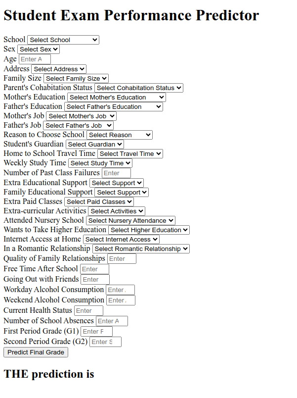

# Student Score Prediction 

## About the Data :

**The dataset** The goal is to predict `score` of a student based on based on ~30 features (Regression Analysis).

### Attributes for student-por.csv (Portuguese language course) datasets:
1 `school` - student's school (binary: "GP" - Gabriel Pereira or "MS" - Mousinho da Silveira)\
2 `sex` - student's sex (binary: "F" - female or "M" - male)\
3 `age` - student's age (numeric: from 15 to 22)\
4 `address` - student's home address type (binary: "U" - urban or "R" - rural)\
5 `famsize` - family size (binary: "LE3" - less or equal to 3 or "GT3" - greater than 3)\
6 `Pstatus` - parent's cohabitation status (binary: "T" - living together or "A" - apart)\
7 `Medu` - mother's education (numeric: 0 - none,  1 - primary education (4th grade)\, 2 – 5th to 9th grade, 3 – secondary education or 4 – higher education)\
8 `Fedu` - father's education (numeric: 0 - none,  1 - primary education (4th grade)\, 2 – 5th to 9th grade, 3 – secondary education or 4 – higher education)\
9 `Mjob` - mother's job (nominal: "teacher", "health" care related, civil "services" (e.g. administrative or police)\, "at_home" or "other")\
10 `Fjob` - father's job (nominal: "teacher", "health" care related, civil "services" (e.g. administrative or police)\, "at_home" or "other")\
11 `reason` - reason to choose this school (nominal: close to "home", school "reputation", "course" preference or "other")\
12 `guardian` - student's guardian (nominal: "mother", "father" or "other")\
13 `traveltime` - home to school travel time (numeric: 1 - <15 min., 2 - 15 to 30 min., 3 - 30 min. to 1 hour, or 4 - >1 hour)\
14 `studytime` - weekly study time (numeric: 1 - <2 hours, 2 - 2 to 5 hours, 3 - 5 to 10 hours, or 4 - >10 hours)\
15 `failures` - number of past class failures (numeric: n if 1<=n<3, else 4)\
16 `schoolsup` - extra educational support (binary: yes or no)\
17 `famsup` - family educational support (binary: yes or no)\
18 `paid` - extra paid classes within the course subject (Math or Portuguese)\ (binary: yes or no)\
19 `activities` - extra-curricular activities (binary: yes or no)\
20 `nursery` - attended nursery school (binary: yes or no)\
21 `higher` - wants to take higher education (binary: yes or no)\
22 `internet` - Internet access at home (binary: yes or no)\
23 `romantic` - with a romantic relationship (binary: yes or no)\
24 `famrel` - quality of family relationships (numeric: from 1 - very bad to 5 - excellent)\
25 `freetime` - free time after school (numeric: from 1 - very low to 5 - very high)\
26 `goout` - going out with friends (numeric: from 1 - very low to 5 - very high)\
27 `Dalc` - workday alcohol consumption (numeric: from 1 - very low to 5 - very high)\
28 `Walc` - weekend alcohol consumption (numeric: from 1 - very low to 5 - very high)\
29 `health` - current health status (numeric: from 1 - very bad to 5 - very good)\
30 `absences` - number of school absences (numeric: from 0 to 93)\
31 `G1` - first period grade (numeric: from 0 to 20)\
31 `G2` - second period grade (numeric: from 0 to 20)\
32 `G3` - final grade (numeric: from 0 to 20, output target)\

Dataset Source Link :
[https://archive.ics.uci.edu/dataset/320/student+performance](https://archive.ics.uci.edu/dataset/320/student+performance)

Research Link :
[https://ieeexplore.ieee.org/document/9222435](https://ieeexplore.ieee.org/document/9222435)

### Screenshot of UI test deployment 

## Approach for the project 

1. Data Ingestion : 
    * In Data Ingestion phase the data is first read as csv. 
    * Then the data is split into training and testing and saved as csv file.

2. Data Transformation : 
    * In this phase a ColumnTransformer Pipeline is created.
    * for Numeric Variables first SimpleImputer is applied with strategy median , then Standard Scaling is performed on numeric data.
    * for Categorical Variables SimpleImputer is applied with most frequent strategy, then ordinal encoding performed , after this data is scaled with Standard Scaler.
    * This preprocessor is saved as pickle file.

3. Model Training : 
    * In this phase base model is tested . The best model found was catboost regressor.
    * After this hyperparameter tuning is performed on catboost and knn model.
    * A final VotingRegressor is created which will combine prediction of catboost, xgboost and knn models.
    * This model is saved as pickle file.

4. Prediction Pipeline : 
    * This pipeline converts given data into dataframe and has various functions to load pickle files and predict the final results in python.

5. Flask App creation : 
    * Flask app is created with User Interface to predict the gemstone prices inside a Web Application.

## Exploratory Data Analysis Notebook

Link : [EDA](<notebook/1. EDA STUDENT PERFORMANCE .ipynb>)

## Model Training Approach Notebook

Link : [MODEL TRAINING](<notebook/2. MODEL TRAINING.ipynb>)

